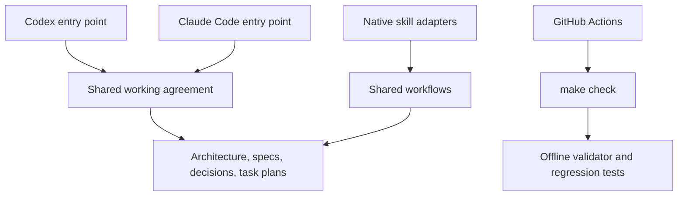

# Architecture

## Project definition

Project name: <name>
Purpose and users: <problem solved and intended users>
Boundaries: <responsibilities and explicit non-goals>

Fill this section when initializing the project. No application stack or service
architecture is selected by this template.

## Application architecture

Document these as the project takes shape:

- **Components and entry points:** main modules, commands, services, or interfaces.
- **Dependency direction:** allowed dependencies and important boundaries.
- **Data flow:** inputs, transformations, state, outputs, and external systems.
- **Contracts:** public interfaces, compatibility requirements, and invariants.
- **Failure handling:** validation, recovery, observability, and operational limits.

Keep this file about the current system. Record the rationale and alternatives for
consequential choices in [design decisions](docs/design-decisions/README.md).

## Included engineering harness

| Component | Responsibility |
| --- | --- |
| [AGENTS.md](AGENTS.md) and [CLAUDE.md](CLAUDE.md) | Direct each tool to the shared agreement. |
| [agent/README.md](agent/README.md) | Define workflow routing, commands, and completion. |
| [agent/workflows/](agent/workflows/) | Hold canonical process logic. |
| `.agents/skills/` and `.claude/skills/` | Expose the same workflows through native skill metadata. |
| [docs/](docs/README.md) | Store project knowledge and task-local state. |
| [check_harness.py](agent/scripts/check_harness.py) | Check structure, local links, adapters, Python/JSON syntax. |
| [Harness tests](agent/tests/test_check_harness.py) | Exercise valid and invalid harness fixtures offline. |
| [CI](.github/workflows/check.yml) | Run `make check`. |

The helpers use Python 3.11+ and the standard library. Make provides command aliases.
Shared workflow logic is maintained once; adapters have matching metadata and
point to their corresponding workflow.

## Validation boundaries

The validator scans the maintained harness and documentation trees. It checks local
inline Markdown links and standalone Claude `@relative/path` imports. Remote URLs,
heading anchors, reference-style Markdown links, application behavior, and actual
agent execution are outside its scope.

Skill metadata uses a deliberately small subset: `name` and `description` as plain
single-line YAML strings starting with an ASCII letter. Extend the validator or
adopt a parser when richer metadata becomes necessary.

GitHub CI exposes a `harness` check. Configure branch rules separately to require it
for merge. Project-specific checks join the same command during initialization.
